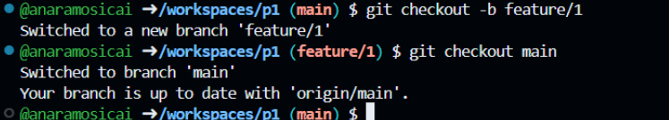
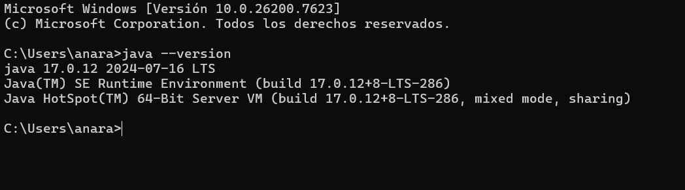
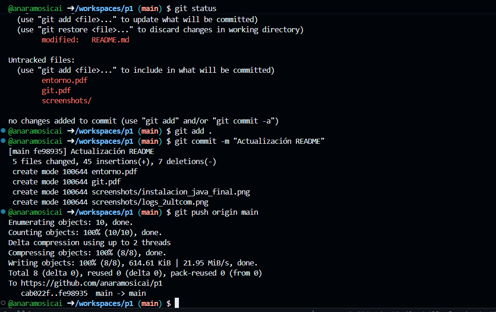

# Práctica 1: Entorno de desarrollo

## 1. Introducción
Esta es la primera práctica de la asignatura de Programación de Aplicaciones Telemeticas, PAT.

Usaremos este repositorio para empezar a usar [Git](https://git-scm.com/) y Github.

## 2. Objetivos
- Preparar el equipo del alumno para poder hacer las futuras prácticas.
- Tener nociones de cómo usar Git y Github.

## 3. Prerrequisitos
- Debemos de tener cuenta en [Github](https://github.com/).

    Esta cuenta será gratuíta y contará con 60h mensuales de uso de [Codespaces](https://github.com/features/codespaces) --> *Entorno de desarrollo en la nube*.

## 4. Desarrollo de la práctica
### **Git y Github**
Desde la cuenta de Github hacer un "fork" del repositorio: https://github.com/gitt-3-pat/p1. 

A continuación, prueba los siguientes comandos sobre el anterior repositorio:

```sh
git clone https://github.com/gitt-3-pat/p1
git status
git add .
git commit -m "TU MENSAJE"
git push

git checkout -b feature/1
git checkout main
```

<small>*Dejo el link del PDF [git.pdf](git.pdf), donde se explica la función de cada comando.*</small>

<small>*Asismismo adjunto una captura de los logs de los dos últimos comandos:*</small>




### **Entorno de Java**
Instala en tu equipo:

- Java 17
- Maven
- Editor de código fuente (VsCode + IntelliJ)

<small>*Dejo el link del PDF [entorno.pdf](entorno.pdf), donde se encuentran las capturas de pantalla de sus ventanas o logs en la CMD.*</small>

<small>*De nuevo adjunto una captura del log de java:*</small>



## Anexo

### Acción adicional
Adjunto una imagen de los comandos usados para subir este README.md


### ¿Como probar en la nube?

[Github-Codespaces](https://github.com/features/codespaces)

### ¿Cómo escribir un README.md con formato?

[Github Markdown](https://docs.github.com/es/get-started/writing-on-github/getting-started-with-writing-and-formatting-on-github/basic-writing-and-formatting-syntax)
